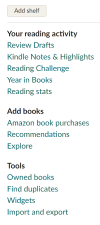

# personal_library
This project will incorporate pieces from several other repos dealing with book data to build a personal library.

## Purpose  
I have a large personal library that includes books, ebooks, and audiobooks. For several years, I've used a free program called [Calibre](https://calibre-ebook.com/) to manage my ebooks. Recently, I've thought about including my audiobooks and physical books, as well, but I'm still trying to find the best way to include everything I want. Calibre is highly customizable, so I've added columns for the books format that will let me include everything together. Of course, those extra columns have to be updated manually, which isn't ideal since there are so many that have multiple formats. Calibre has a plug-in that allows it to import a csv list of books, so I thought it might be better to combine all my books into one csv file and import them already set up with the formats for each book already there. Once I have the library set up correctly in Calibre, there are several programs that will let me use the Calibre database to create a website. I have one at the moment running on a Synology home server in Docker, but it only has ebooks.

## Data  
I haven't included my data in the repo, but I'll add details about how I gathered it all. If anyone wants to use my code for their own books, make sure you either create a folder called my_data to hold the files with your data, or change the code to reflect the location of your own data.

**Goodreads Data**  
I keep up with the number of books I read per year with the Goodreads Challenge. Many of the other shelves in my goodreads library are old and really need to be cleaned. However, I exported all the books I have on the site so sort out later which ones to keep and which to delete. To get your own books from goodready, go to My Books on the top menu, then scroll down the page. Towards the bottom on the left side under your shelves, you'll see Tools with Import and Export at the bottom of that list. 

**Audible Data**  
I have a friend who uses Audible, so we share our books between us. We usually check to see if the other person has a book before we buy it, but sometimes we do both buy the same book. Having a library website may help with that since it doesn't require any signing off and switching accounts or looking at the person's library on the Audible website. I've used [OpenAudible](https://openaudible.org/) for a few years to get a csv of my my audible books. I bought a license which allows me to use openaudible with more than one account, so I can get information for my friend's library as well. Recently, I ran across a browser extension called [Audible Library Extractor](https://joonaspaakko.gitbook.io/audible-library-extractor. It works when you go to your Audible library page and gives you the option to download a csv of the titles you own. Interestingly, I used both of these methods to see if they downloaded the same books, but the file from Audible Library Extractor has about 10 more books then the OpenAudible file. I'll have to dig into that a bit more to see what's going on, especially since my Audible app says I own over 20 more than both the csv files say I do. 

**Audiobooks Not From Audible**  
I have almost as many non-Audible books that are all mp3 format in file folders. Excel can now get a list of files from a folder and subfolders. I have a folder called Audiobooks and then subfolders for each author, with subfolders inside authors' folders for series, and the files inside each series with the book. If a book isn't in a series, it's in a folder inside the author folder. For example, to findthe first Sookie Stackhouse book, I'd look in Audiobooks > Charlaine Harris > Sookie Stackhouse Series > 01 - Dead After Dark > Dead After Dark.mp3. After getting all the files in my audiobooks folder, I clean them up a bit in Excel. There's no metadata with these files, but I can get the author or authors for almost every book (I have some anthologies that won't have that info), and the series name and number. I'll either add them to Calibre with just that information or find a way to scrape data from somewhere else.

**Ebook data**  
The books that I own and didn't buy through Amazon are already in Calibre. I exported a csv file listing all those. I haven't moved all my Amazon books to Calibre yet, so I'll need to figure out how to get that information from Amazon. I can always download them to the Kindle app on my PC and import them into Calibre if I can't find a better way. It won't be fast that way, but it works. I'll worry more about that later.

## Some of my plans  
Eventually, I see this being either a mobile or webapp. There will be a library, a search, the option to create a playlist for a book, ways to look at your personal reading statistics, and some way to come up with recommendations. That last part is going to be tricky since the library will only be available for myself and a few family members - no more than 10 people. That's not going to be enough to have members rate their books and use that for recommendations. I'd also like to figure out a way to recommend an author based on other authors the user likes. Something like [Literature Map](https://www.literature-map.com/) but not as visual (in other words...simpler 😊).  

I've already started a project that will create a playlist for a book I choose. I still have to get that linked to Spotify so it will create the playlist automatically. I also want to add more genres of music and will use books from my library instead of one I found online. I'm working on a recommender system for books using rating information from Goodreads right now, and saw a really neat way to make the search for books more appealing. Instead of having a url for the book information and cover, it creates a nicely printed list of possible matches for the book you input. Having the covers will definitely come in handy since so many books have the same titles, but are easily recognizable ty the cover, as well as the author. Many have different covers for audio and ebook formats, too, so having that visual will help chose the correct book more quickly. It looks much nicer than what I have at the moment, too. 
